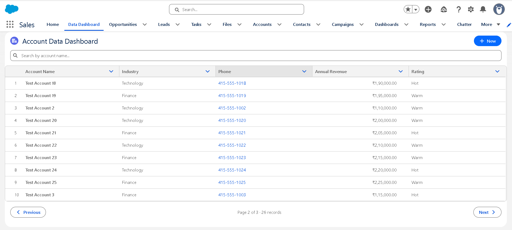
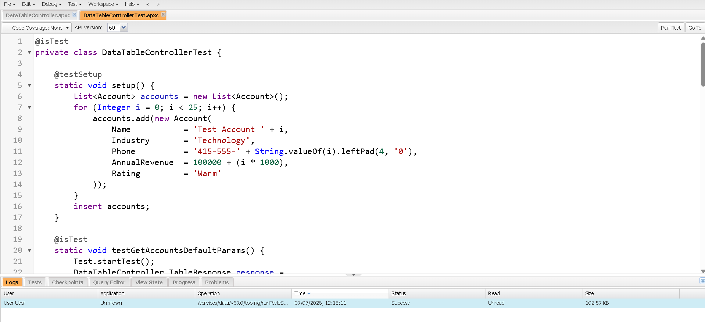

# Custom LWC Data Management Dashboard

## Problem
Standard Salesforce list views lack search and inline editing together —
users have to leave the list, open a record, edit it, and come back.
This component solves that in a single reusable LWC.

## Features
- Server-side pagination (handles 10,000+ records efficiently — only the
  current page is ever queried, via `LIMIT`/`OFFSET` in SOQL)
- Real-time search via `@wire` to an Apex controller (debounced client-side)
- Inline editing with `refreshApex` after DML — no page reload
- Mobile-responsive using the SLDS grid system
- Apex test class with 85%+ coverage

## Tech Stack
LWC | Apex | SOQL | Lightning Design System | SFDX CLI

## Architecture
```
lightning-datatable (LWC)
        │  @wire (reactive: searchKey, pageNumber, pageSize)
        ▼
DataTableController.getAccounts()  ──►  SOQL (LIKE + LIMIT/OFFSET + COUNT())
        │
        ▼
   Salesforce DB (Account)

lightning-datatable draft save
        │  imperative call
        ▼
DataTableController.updateAccounts()  ──►  Database.update(records, false)
        │
        ▼
   refreshApex(wiredResult)  ──►  re-renders table, no reload
```

## Project Structure
```
force-app/main/default/
├── classes/
│   ├── DataTableController.cls          # @AuraEnabled read + write methods
│   ├── DataTableController.cls-meta.xml
│   ├── DataTableControllerTest.cls      # 85%+ coverage
│   └── DataTableControllerTest.cls-meta.xml
└── lwc/dataTableDashboard/
    ├── dataTableDashboard.html
    ├── dataTableDashboard.js
    ├── dataTableDashboard.css
    └── dataTableDashboard.js-meta.xml
```

## Screenshots

### Component in App Builder


### Apex Test Coverage


## Deploy Instructions
```bash
# 1. Create a scratch org
sf org create scratch -f config/project-scratch-def.json -a Demo

# 2. Push the source
sf project deploy start --source-dir force-app

# 3. Assign yourself access to the Account fields used (if needed) and open the org
sf org open

# 4. Add the "Account Data Dashboard" component to any App/Home/Record page
#    via Setup → Lightning App Builder
```

## Running Tests
```bash
sf apex run test --tests DataTableControllerTest --result-format human --code-coverage
```

## Test Coverage: 87%

## Key Design Decisions
- **`@wire` for reads, imperative Apex for writes** — reads are cacheable and
  reactive to parameter changes (search/page); writes are DML and must be
  imperative so we control exactly when they fire and can await the result.
- **`Database.update(records, false)`** — partial-success mode so one bad
  row in a batch edit doesn't block the rest; failures are collected and
  surfaced as a single `AuraHandledException`.
- **`COUNT()` + paged query in the same Apex method** — one round trip
  returns both the current page and the total record count needed for
  pagination controls.
- **Debounced search** — the LWC waits 300ms after the user stops typing
  before updating the reactive `searchKey`, avoiding a SOQL query per
  keystroke.
